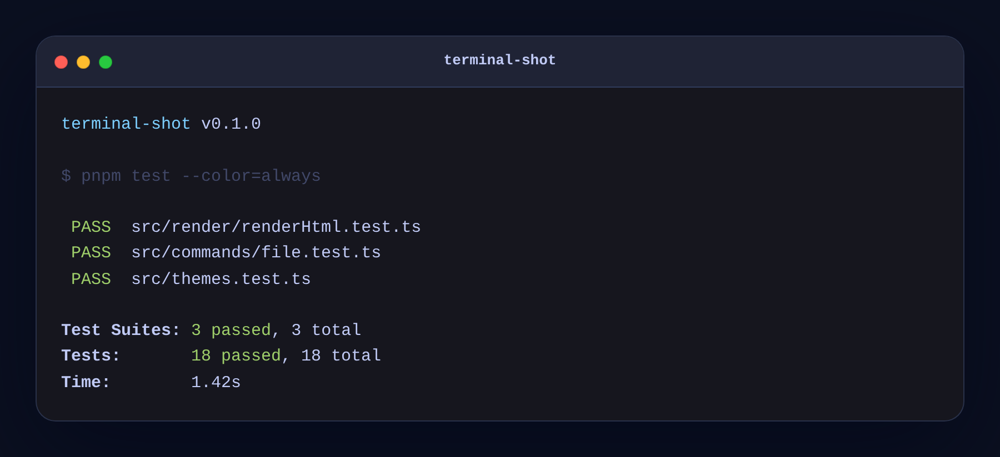

# terminal-shot

Turn terminal output into beautiful shareable images for READMEs, docs, Discord, and social posts.

[](./LICENSE)

`terminal-shot` is a local-first developer CLI that renders ANSI text, command output, or files into polished PNG, SVG, or HTML snapshots. It does not record your screen, capture your desktop, or upload anything.



## Install

Clone the repo and install it globally with npm:

```bash
git clone https://github.com/david-x3d/terminal-shot.git
cd terminal-shot
npm install -g .
```

That installs dependencies, builds the project, and links `terminal-shot` onto your PATH. After it finishes you can run `terminal-shot` from anywhere.

PNG export uses Playwright's headless Chromium. The first time you render a PNG, install the browser:

```bash
npx playwright install chromium
```

## Quick start

Run with no arguments to launch the interactive wizard:

```bash
terminal-shot
```

The wizard walks you through:

1. What to capture — a shell command, a text file, pasted text, or the built-in demo.
2. Theme.
3. Window title (optional).
4. Output file.

That's the whole flow. No flags to remember.

## Pipe support

Anything piped into `terminal-shot` is rendered directly. ANSI colors are preserved.

```bash
ls --color=always | terminal-shot -o ls.png
fastfetch | terminal-shot -o fastfetch.png
git status | terminal-shot --theme dracula -o status.png
npm test --color=always | terminal-shot --title "npm test" -o tests.png
```

If you don't pass `-o`, the output goes to `terminal-shot.png` in the current directory.

## Other ways to use it

Render a built-in demo:

```bash
terminal-shot demo -o demo.png
```

Run a command and render its output:

```bash
terminal-shot run "git status --short" -o status.png
```

Render a text file:

```bash
terminal-shot file output.txt -o output.png
```

Export SVG or HTML instead of PNG:

```bash
terminal-shot demo --format svg -o demo.svg
terminal-shot file output.txt --format html -o output.html
```

## Themes

List them:

```bash
terminal-shot themes
```

Built-ins: `dark`, `catppuccin`, `tokyo-night`, `dracula`, `nord`, `github-dark`, `github-light`, `glass`, `mono`, `matrix`.

Pick one:

```bash
terminal-shot demo --theme glass -o glass.png
```

## Common options

```bash
terminal-shot demo \
  --theme tokyo-night \
  --title "npm test" \
  --subtitle "~/repo/terminal-shot" \
  --width 900 \
  --padding 32 \
  --radius 18 \
  --font-size 15 \
  --scale 2 \
  -o demo.png
```

| Flag | Description |
| --- | --- |
| `-o, --output <file>` | Output path |
| `--format png\|svg\|html` | Output format |
| `--theme <name>` | Built-in theme |
| `--title <text>` / `--subtitle <text>` | Window header text |
| `--no-header` | Hide the title/subtitle |
| `--window` / `--no-window` | Show or hide window chrome |
| `--shadow` / `--no-shadow` | Drop shadow |
| `--font <family>` / `--font-size <n>` / `--line-height <n>` | Typography |
| `--padding <n>` / `--radius <n>` | Spacing |
| `--width <n>` / `--max-height <n>` / `--scale <n>` | Sizing and DPR |
| `--background <css>` / `--transparent` | Background |
| `--prompt <text>` / `--cwd <text>` | Faux shell prompt |
| `--watermark <text>` | Small watermark |
| `--config <file>` | Custom config path |
| `--json` | Print render metadata as JSON |

## Config

Create a config file:

```bash
terminal-shot init
```

`terminal-shot.config.json`:

```json
{
  "theme": "tokyo-night",
  "fontSize": 15,
  "padding": 32,
  "radius": 18,
  "window": true,
  "shadow": true,
  "width": 900
}
```

Then use a custom path with `--config`:

```bash
terminal-shot demo --config ./shot.config.json -o demo.png
```

## Privacy

`terminal-shot` is local-only by design:

- no telemetry
- no cloud rendering
- no uploads
- no screen capture
- no desktop environment required

Text is rendered into HTML locally; a headless browser is only used when PNG output is requested.

## Why not a screenshot tool?

Screen capture is great when you need the real screen. `terminal-shot` is for clean, reproducible terminal artwork:

- output is generated from text, not pixels from your desktop
- ANSI colors are preserved
- renders work in CI and headless environments
- results are consistent across machines
- commands and docs can generate their own images

## Limitations

- PNG export requires Playwright's Chromium browser.
- Command mode uses your system shell. Treat it like running the command directly.
- Interactive full-screen terminal programs are not the target. Pipe their output first.

## Development

```bash
git clone https://github.com/david-x3d/terminal-shot.git
cd terminal-shot
npm install
npm run build
npx playwright install chromium
node dist/index.js demo -o examples/demo.png
```

Smoke tests:

```bash
printf '\033[32mPASS\033[0m hello\n' | node dist/index.js --format html -o examples/stdin.html
node dist/index.js file examples/demo.txt --format svg -o examples/demo.svg
node dist/index.js demo -o examples/demo.png
```

## License

MIT
